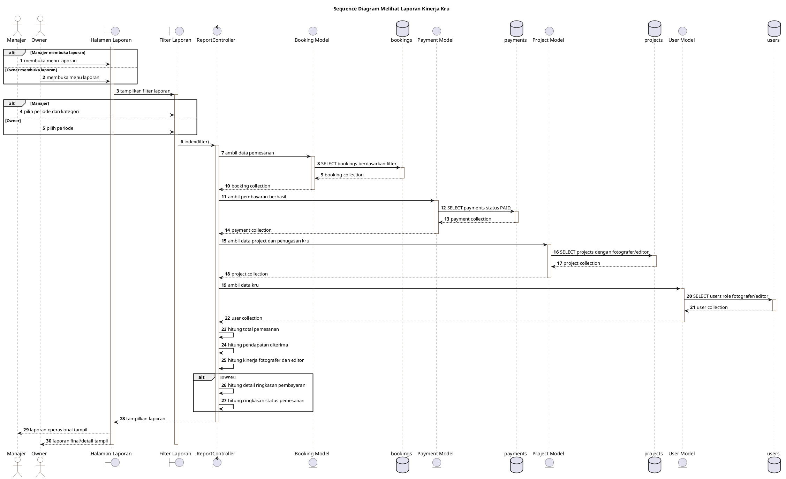
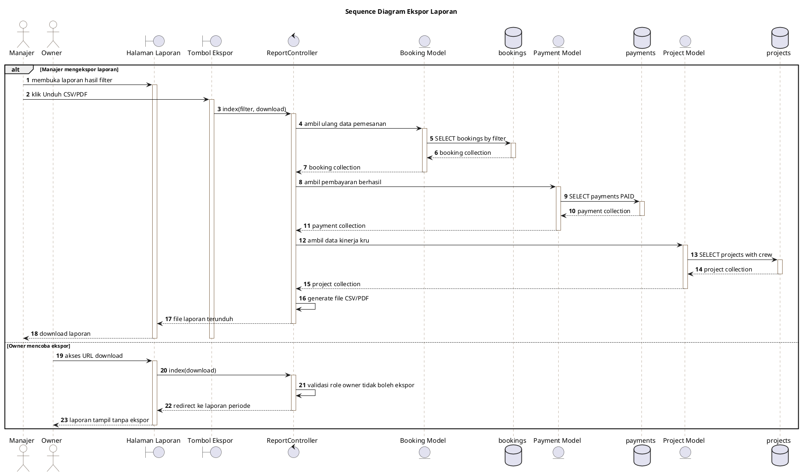

# Revisi Laporan Kinerja Kru

## BPMN Laporan Kinerja Kru Sedang Berjalan

Berdasarkan BPMN laporan kinerja kru yang sedang berjalan di Alter Studio, proses penyusunan laporan masih dilakukan secara manual dengan memanfaatkan data pemesanan, data pembayaran, dan catatan penugasan kru yang tersebar pada media pencatatan internal. Tahapan proses laporan kinerja kru yang sedang berjalan adalah sebagai berikut:

1. **Manajer: Mengumpulkan Data Pemesanan**
   Manajer mengumpulkan data pemesanan dari catatan internal atau Notion yang sebelumnya telah diinput oleh admin.

2. **Manajer: Mengumpulkan Data Pembayaran**
   Manajer memeriksa data pembayaran yang sudah tercatat untuk mengetahui pemesanan yang telah melakukan pembayaran.

3. **Manajer: Mengumpulkan Data Penugasan Kru**
   Manajer melihat data fotografer dan editor yang bertugas pada masing-masing pemesanan berdasarkan catatan operasional.

4. **Manajer: Memeriksa Kelengkapan Data**
   Manajer memeriksa apakah data pemesanan, pembayaran, fotografer, dan editor sudah lengkap.

5. **Gateway: Data Lengkap?**
   Jika data belum lengkap, manajer perlu menghubungi admin atau kru terkait untuk melengkapi data. Jika data lengkap, proses dilanjutkan ke penyusunan laporan.

6. **Manajer: Menghitung Total Pemesanan**
   Manajer menghitung jumlah pemesanan dalam periode laporan secara manual.

7. **Manajer: Menghitung Total Pendapatan**
   Manajer menghitung total pendapatan berdasarkan pembayaran yang berhasil tercatat.

8. **Manajer: Menghitung Kinerja Fotografer**
   Manajer menghitung jumlah project yang ditangani oleh masing-masing fotografer.

9. **Manajer: Menghitung Kinerja Editor**
   Manajer menghitung jumlah project yang ditangani oleh masing-masing editor.

10. **Manajer: Menyusun Laporan Manual**
    Manajer menyusun laporan kinerja kru dalam bentuk rekap manual menggunakan data yang telah dihitung.

11. **Owner: Menerima Laporan**
    Owner menerima laporan akhir dari manajer untuk melihat kondisi pemasukan dan kinerja kru.

12. **Owner: Meninjau Laporan**
    Owner meninjau laporan yang telah disusun untuk kebutuhan evaluasi dan pengambilan keputusan.

13. **Selesai**
    Proses laporan selesai setelah laporan diterima dan ditinjau oleh owner.

## BPMN Laporan Kinerja Kru Diusulkan

Berdasarkan BPMN laporan kinerja kru yang diusulkan, proses laporan dibuat lebih terintegrasi melalui sistem. Data pemesanan, pembayaran, project, fotografer, dan editor diambil langsung dari database sehingga manajer tidak perlu menghitung laporan secara manual. Pada sistem yang diusulkan, manajer berperan dalam melakukan filter, pengolahan, dan ekspor laporan, sedangkan owner berperan melihat laporan final/detail berdasarkan periode yang dipilih. Tahapan proses laporan kinerja kru yang diusulkan adalah sebagai berikut:

1. **Manajer: Membuka Menu Laporan**
   Manajer membuka menu laporan pada sistem untuk melihat data laporan operasional.

2. **Manajer: Memilih Filter Laporan**
   Manajer memilih periode laporan dan kategori layanan yang ingin ditampilkan.

3. **Sistem: Mengambil Data Pemesanan**
   Sistem mengambil data pemesanan berdasarkan periode dan kategori yang dipilih.

4. **Sistem: Mengambil Data Pembayaran Berhasil**
   Sistem mengambil data pembayaran dengan status berhasil sebagai dasar perhitungan pendapatan.

5. **Sistem: Mengambil Data Project dan Penugasan Kru**
   Sistem mengambil data project yang memiliki penugasan fotografer dan editor.

6. **Sistem: Menghitung Ringkasan Laporan**
   Sistem menghitung total pemesanan, pendapatan diterima, jumlah fotografer bertugas, jumlah editor bertugas, dan jumlah klien aktif.

7. **Sistem: Menghitung Kinerja Kru**
   Sistem menghitung kinerja fotografer dan editor berdasarkan jumlah project yang ditangani pada periode laporan.

8. **Sistem: Menampilkan Laporan**
   Sistem menampilkan laporan dalam bentuk ringkasan, tabel pemesanan, dan data kinerja kru.

9. **Manajer: Mengekspor Laporan**
   Manajer dapat mengekspor laporan dalam bentuk CSV atau PDF sebagai dokumen laporan operasional.

10. **Owner: Membuka Menu Laporan**
    Owner membuka menu laporan untuk melihat laporan akhir yang telah tersedia pada sistem.

11. **Owner: Memilih Periode Laporan**
    Owner hanya memilih periode laporan yang ingin dilihat tanpa melakukan ekspor CSV atau PDF.

12. **Sistem: Menampilkan Laporan Final Owner**
    Sistem menampilkan laporan final/detail untuk owner, meliputi pendapatan diterima, ringkasan pembayaran, status pemesanan, dan kinerja kru.

13. **Owner: Meninjau Laporan Final**
    Owner meninjau laporan sebagai dasar evaluasi bisnis dan pengambilan keputusan.

14. **Selesai**
    Proses laporan selesai setelah manajer dapat mengolah laporan dan owner dapat melihat laporan final melalui sistem.

## Revisi Use Case Scenario

### UCS - Melihat Laporan Kinerja Kru

| Komponen | Keterangan |
|---|---|
| Nama Use Case | Melihat Laporan Kinerja Kru |
| Aktor | Manajer, Owner |
| Tujuan | Menampilkan laporan pemesanan, pendapatan, dan kinerja kru berdasarkan periode tertentu. |
| Prasyarat | Aktor sudah login dan memiliki hak akses sebagai manajer atau owner. |
| Kondisi Awal | Data pemesanan, pembayaran, project, fotografer, dan editor sudah tersimpan dalam database. |
| Alur Utama | 1. Aktor membuka menu laporan. 2. Sistem menampilkan halaman laporan. 3. Manajer memilih periode dan kategori layanan, sedangkan owner memilih periode saja. 4. Sistem mengambil data pemesanan, pembayaran, project, dan kru sesuai filter. 5. Sistem menghitung ringkasan laporan dan kinerja kru. 6. Sistem menampilkan laporan kepada aktor. |
| Alur Alternatif | Jika data pada periode yang dipilih tidak tersedia, sistem menampilkan laporan kosong dengan informasi bahwa belum ada data pada periode tersebut. |
| Kondisi Akhir | Laporan kinerja kru tampil sesuai filter yang dipilih. |

### UCS - Ekspor Laporan

| Komponen | Keterangan |
|---|---|
| Nama Use Case | Ekspor Laporan |
| Aktor | Manajer |
| Tujuan | Mengunduh laporan operasional dalam bentuk CSV atau PDF. |
| Prasyarat | Manajer sudah login dan membuka menu laporan. |
| Kondisi Awal | Data laporan sudah tampil berdasarkan filter periode dan kategori yang dipilih. |
| Alur Utama | 1. Manajer memilih periode dan kategori laporan. 2. Sistem menampilkan laporan. 3. Manajer menekan tombol Unduh CSV atau Unduh PDF. 4. Sistem mengambil ulang data sesuai filter. 5. Sistem membuat file laporan. 6. Sistem mengunduh file laporan kepada manajer. |
| Alur Alternatif | Jika owner mencoba mengakses URL ekspor secara langsung, sistem menolak akses ekspor dan mengarahkan kembali ke halaman laporan. |
| Kondisi Akhir | File laporan berhasil diunduh oleh manajer. |

## Revisi Sequence Diagram

### Sequence Diagram Melihat Laporan Kinerja Kru

### Sequence Diagram Ekspor Laporan

## Revisi Class Analysis Diagram

### Class Analysis Melihat Laporan Kinerja Kru

| Komponen | Isi |
|---|---|
| Aktor | Manajer, Owner |
| Boundary Class | Menu Laporan, Halaman Laporan, Filter Laporan, Tampilan Ringkasan Laporan, Tampilan Kinerja Kru, Tampilan Detail Owner |
| Control Class | ReportController |
| Entity Class | Booking, Payment, Project, User, ServiceCategory |
| Hubungan Garis | Manajer -- Menu Laporan -- Halaman Laporan -- Filter Laporan -- ReportController -- Booking / Payment / Project / User / ServiceCategory; Owner -- Menu Laporan -- Halaman Laporan -- Filter Laporan -- ReportController -- Booking / Payment / Project / User |

### Class Analysis Ekspor Laporan

| Komponen | Isi |
|---|---|
| Aktor | Manajer |
| Boundary Class | Halaman Laporan, Filter Laporan, Tombol Ekspor CSV, Tombol Ekspor PDF |
| Control Class | ReportController |
| Entity Class | Booking, Payment, Project, User, ServiceCategory |
| Hubungan Garis | Manajer -- Halaman Laporan -- Filter Laporan -- Tombol Ekspor CSV/PDF -- ReportController -- Booking / Payment / Project / User / ServiceCategory |

## Catatan Revisi Diagram

- Pada use case diagram, relasi **Ekspor Laporan** hanya dihubungkan dengan aktor **Manajer**.
- Aktor **Owner** hanya dihubungkan dengan use case **Melihat Laporan Kinerja Kru** atau **Melihat Laporan Final**.
- Pada sequence diagram, proses ekspor tidak dilakukan oleh owner.
- Pada class analysis, boundary ekspor CSV/PDF hanya muncul pada class analysis Ekspor Laporan dengan aktor manajer.
- Pada BPMN usulan, owner tidak melakukan ekspor, melainkan hanya memilih periode dan melihat laporan final/detail.
