# Kode PlantUML Sequence Diagram Lampiran B

Berisi 38 sequence diagram tambahan dari daftar SD-B01 sampai SD-B45.

## SD-B01 - Lihat Landing Page
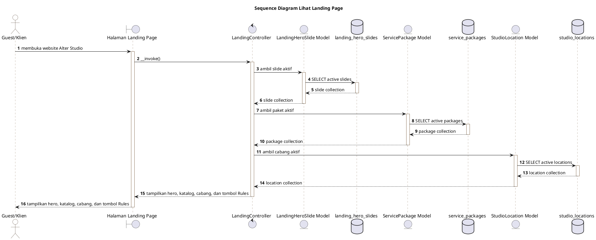

## SD-B02 - Lihat Rules
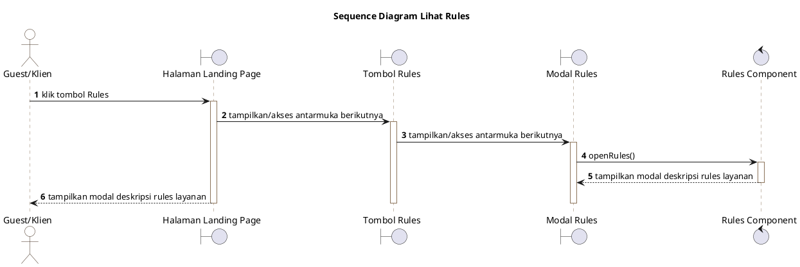

## SD-B05 - Verifikasi Email
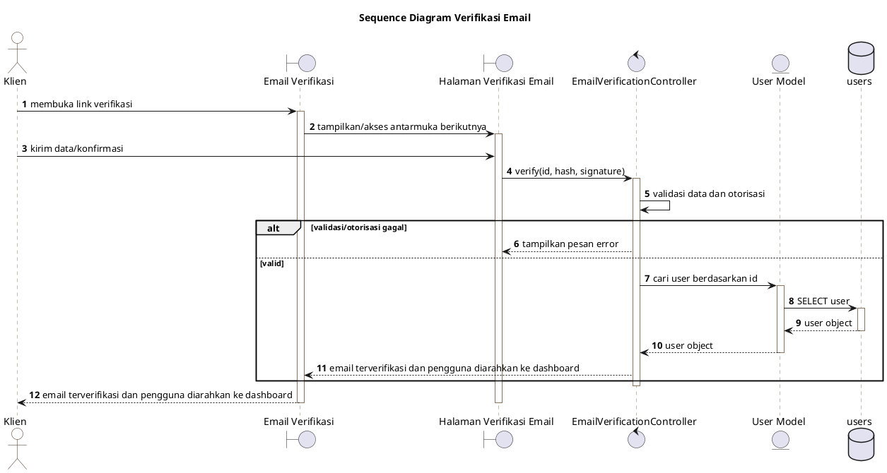

## SD-B06 - Lupa Password
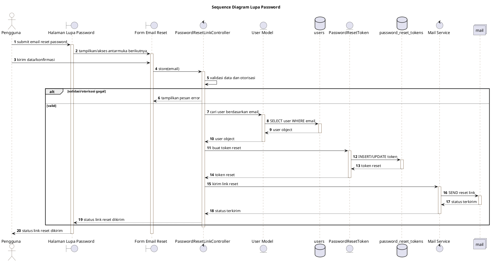

## SD-B07 - Reset Password
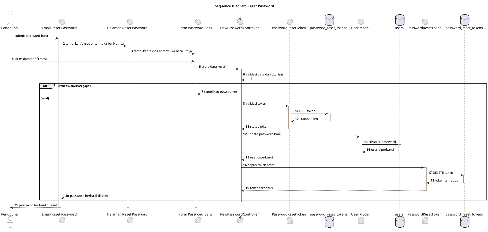

## SD-B08 - Lihat Profil
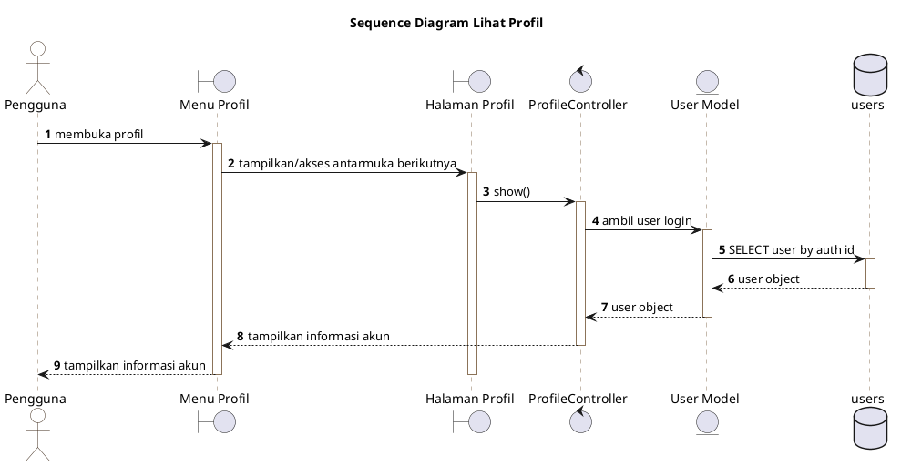

## SD-B09 - Edit Profil
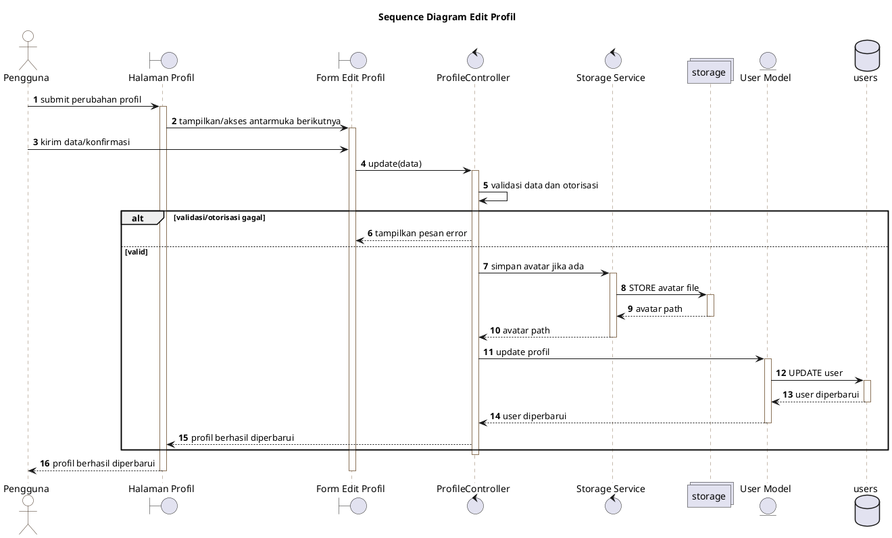

## SD-B10 - Hapus Akun Profil
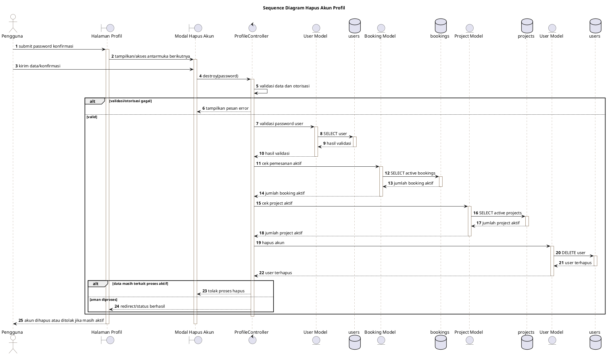

## SD-B11 - Ubah Password Profil
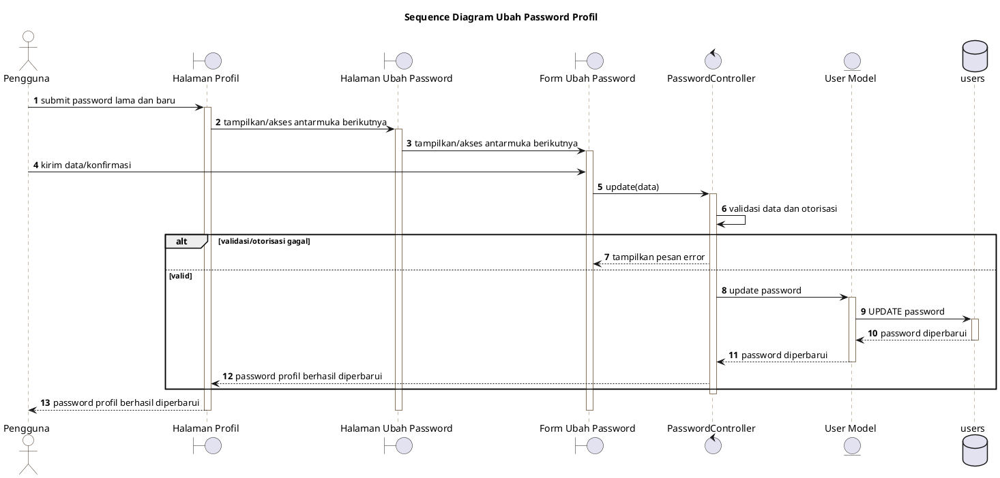

## SD-B12 - Lihat Dashboard
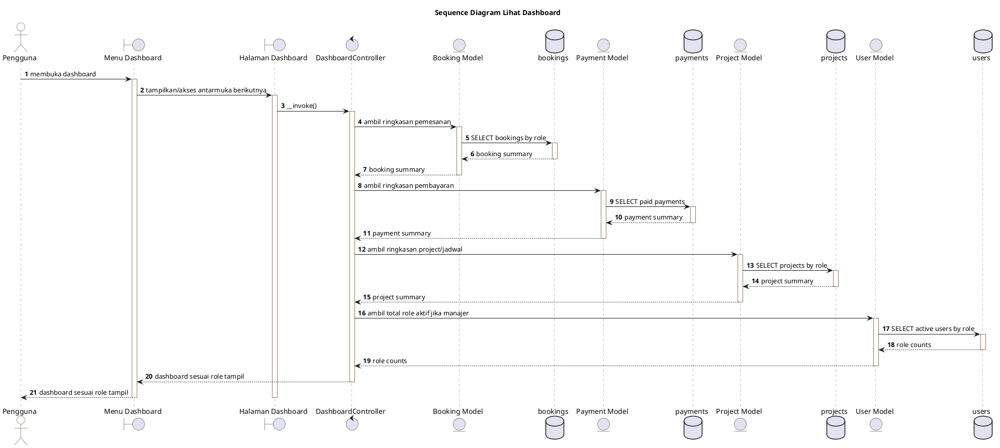

## SD-B13 - Lihat Kategori Layanan
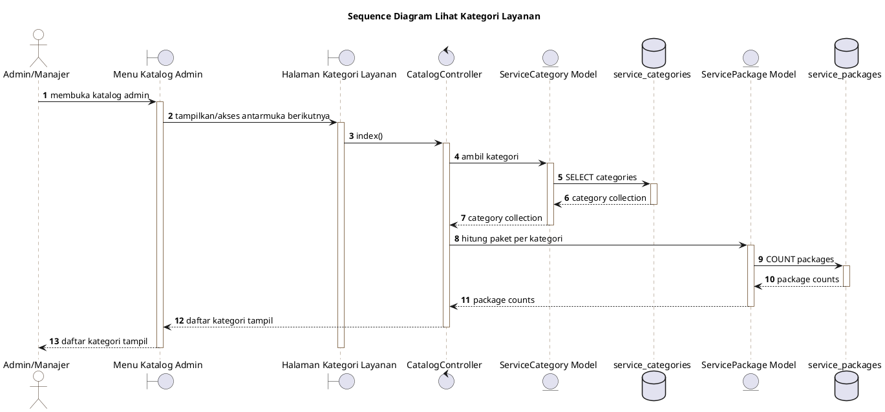

## SD-B14 - Tambah Kategori Layanan
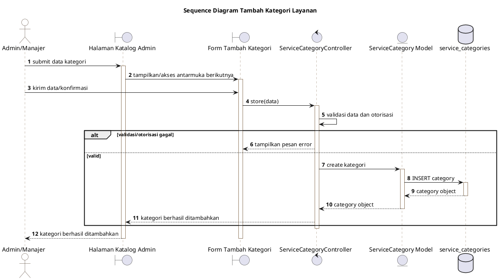

## SD-B15 - Edit Kategori Layanan
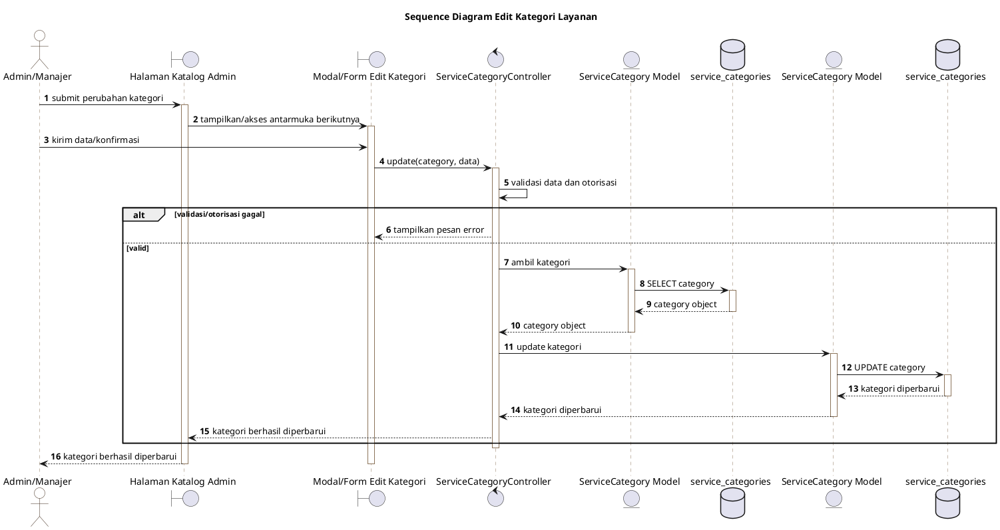

## SD-B16 - Hapus Kategori Layanan
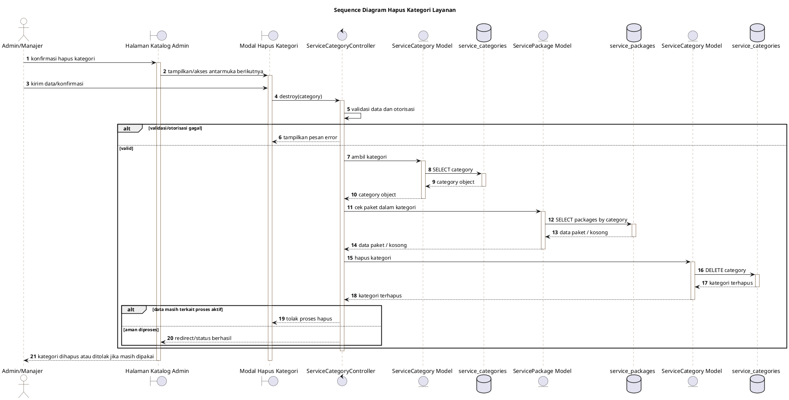

## SD-B17 - Lihat Paket Layanan
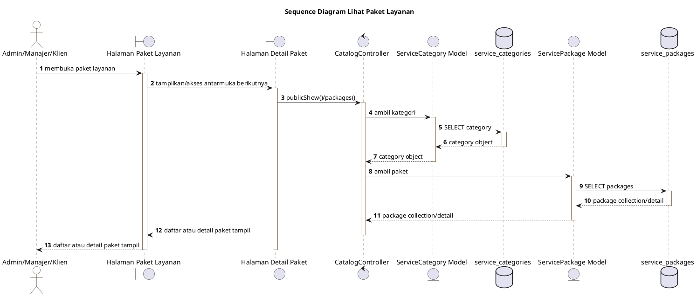

## SD-B18 - Tambah Paket Layanan
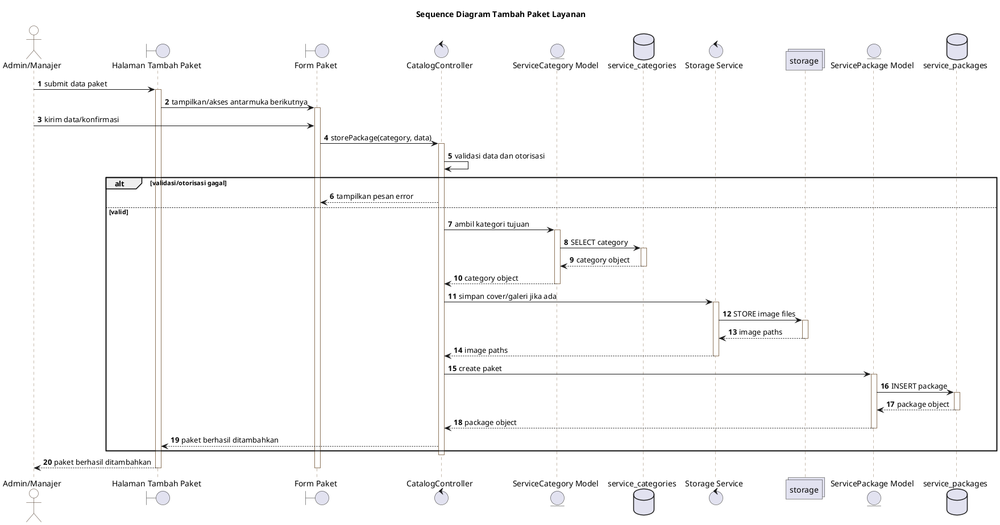

## SD-B19 - Edit Paket Layanan
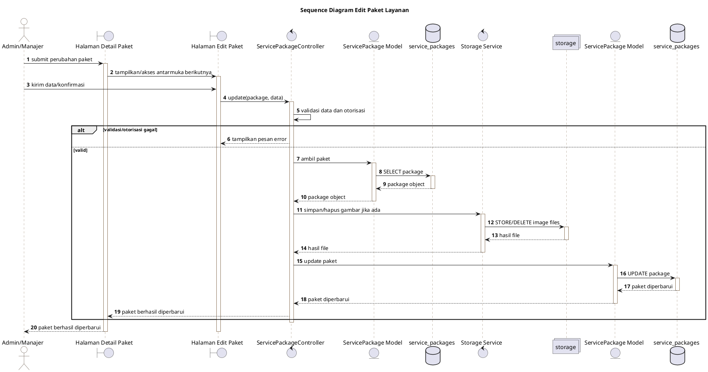

## SD-B20 - Hapus Paket Layanan
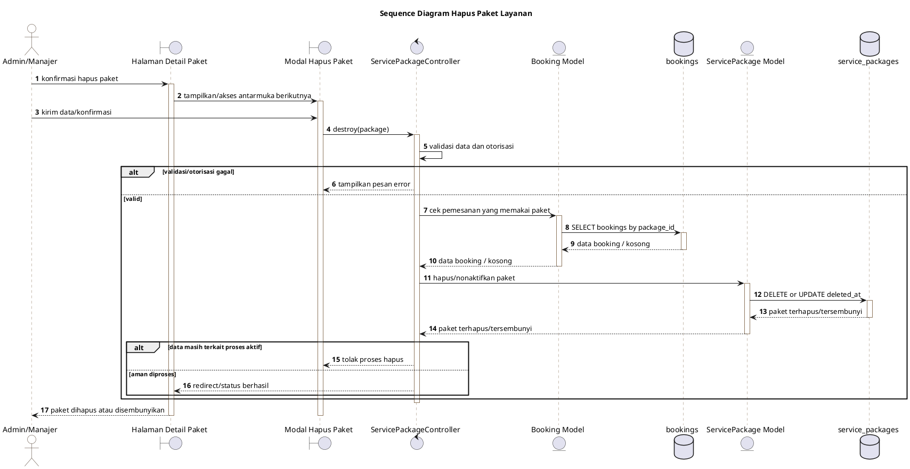

## SD-B22 - Menolak Pemesanan
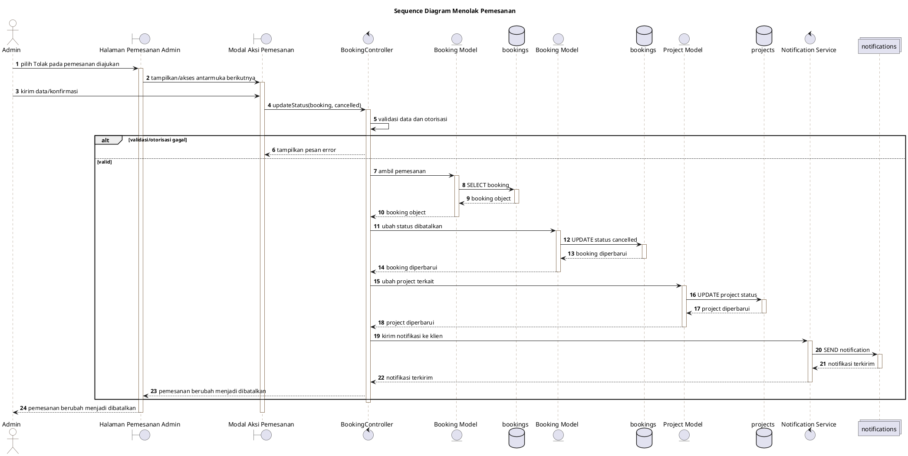

## SD-B25 - Lihat Menu dan Status Pemesanan
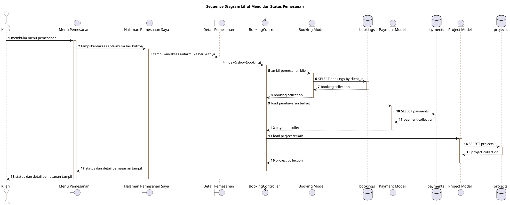

## SD-B26 - Edit Jadwal
```plantuml
@startuml SD-B26
title Sequence Diagram Edit Jadwal
skinparam backgroundColor #FFFFFF
skinparam sequenceArrowThickness 1
skinparam sequenceLifeLineBorderColor #8B7359
skinparam sequenceParticipantBorderColor #8B7359
skinparam sequenceParticipantBackgroundColor #FAF6F0
skinparam actorBorderColor #3F2B1B
skinparam actorBackgroundColor #FFFFFF
autonumber
actor "Admin" as Actor
boundary "Halaman Jadwal" as B1
boundary "Form Jadwal Kru" as B2
control "ScheduleController" as Controller
entity "Booking Model" as M1
database "bookings" as DB1
entity "User Model" as M2
database "users" as DB2
entity "Project Model" as M3
database "projects" as DB3
entity "Project Model" as M4
database "projects" as DB4
control "Notification Service" as M5
collections "notifications" as DB5

Actor -> B1: submit perubahan jadwal
activate B1
B1 -> B2: tampilkan/akses antarmuka berikutnya
activate B2
Actor -> B2: kirim data/konfirmasi
B2 -> Controller: update(project, data)
activate Controller
Controller -> Controller: validasi data dan otorisasi
alt validasi/otorisasi gagal
    Controller --> B2: tampilkan pesan error
else valid
    Controller -> M1: validasi booking
    activate M1
    M1 -> DB1: SELECT booking
    activate DB1
    DB1 --> M1: booking object
    deactivate DB1
    M1 --> Controller: booking object
    deactivate M1
    Controller -> M2: ambil kru aktif
    activate M2
    M2 -> DB2: SELECT active photographer/editor
    activate DB2
    DB2 --> M2: crew collection
    deactivate DB2
    M2 --> Controller: crew collection
    deactivate M2
    Controller -> M3: cek konflik jadwal
    activate M3
    M3 -> DB3: SELECT overlapping schedules
    activate DB3
    DB3 --> M3: data konflik / kosong
    deactivate DB3
    M3 --> Controller: data konflik / kosong
    deactivate M3
    Controller -> M4: update jadwal dan kru
    activate M4
    M4 -> DB4: UPDATE schedule and crew
    activate DB4
    DB4 --> M4: project diperbarui
    deactivate DB4
    M4 --> Controller: project diperbarui
    deactivate M4
    Controller -> M5: kirim notifikasi tugas
    activate M5
    M5 -> DB5: SEND notification
    activate DB5
    DB5 --> M5: notifikasi terkirim
    deactivate DB5
    M5 --> Controller: notifikasi terkirim
    deactivate M5
    Controller --> B1: jadwal berhasil diperbarui atau ditolak jika konflik
end
deactivate Controller
B1 --> Actor: jadwal berhasil diperbarui atau ditolak jika konflik
deactivate B2
deactivate B1
@enduml
```

## SD-B27 - Lihat Jadwal Tugas
```plantuml
@startuml SD-B27
title Sequence Diagram Lihat Jadwal Tugas
skinparam backgroundColor #FFFFFF
skinparam sequenceArrowThickness 1
skinparam sequenceLifeLineBorderColor #8B7359
skinparam sequenceParticipantBorderColor #8B7359
skinparam sequenceParticipantBackgroundColor #FAF6F0
skinparam actorBorderColor #3F2B1B
skinparam actorBackgroundColor #FFFFFF
autonumber
actor "Admin/Fotografer/Editor" as Actor
boundary "Menu Jadwal" as B1
boundary "Halaman Jadwal Tugas" as B2
control "ScheduleController" as Controller
entity "Project Model" as M1
database "projects" as DB1
entity "Booking Model" as M2
database "bookings" as DB2
entity "User Model" as M3
database "users" as DB3

Actor -> B1: membuka menu jadwal
activate B1
B1 -> B2: tampilkan/akses antarmuka berikutnya
activate B2
B2 -> Controller: index(filter)
activate Controller
Controller -> M1: ambil jadwal sesuai role
activate M1
M1 -> DB1: SELECT scheduled projects
activate DB1
DB1 --> M1: project collection
deactivate DB1
M1 --> Controller: project collection
deactivate M1
Controller -> M2: load booking terkait
activate M2
M2 -> DB2: SELECT bookings
activate DB2
DB2 --> M2: booking relation
deactivate DB2
M2 --> Controller: booking relation
deactivate M2
Controller -> M3: load kru terkait
activate M3
M3 -> DB3: SELECT users
activate DB3
DB3 --> M3: crew relation
deactivate DB3
M3 --> Controller: crew relation
deactivate M3
Controller --> B1: jadwal tugas tampil
deactivate Controller
B1 --> Actor: jadwal tugas tampil
deactivate B2
deactivate B1
@enduml
```

## SD-B30 - Lihat Detail Project
```plantuml
@startuml SD-B30
title Sequence Diagram Lihat Detail Project
skinparam backgroundColor #FFFFFF
skinparam sequenceArrowThickness 1
skinparam sequenceLifeLineBorderColor #8B7359
skinparam sequenceParticipantBorderColor #8B7359
skinparam sequenceParticipantBackgroundColor #FAF6F0
skinparam actorBorderColor #3F2B1B
skinparam actorBackgroundColor #FFFFFF
autonumber
actor "Pengguna Terkait" as Actor
boundary "Halaman Detail Project" as B1
control "ProjectController" as Controller
entity "Project Model" as M1
database "projects" as DB1
entity "Booking Model" as M2
database "bookings" as DB2
entity "Payment Model" as M3
database "payments" as DB3
entity "User Model" as M4
database "users" as DB4

Actor -> B1: membuka detail project
activate B1
B1 -> Controller: show(project)
activate Controller
Controller -> M1: ambil project
activate M1
M1 -> DB1: SELECT project
activate DB1
DB1 --> M1: project object
deactivate DB1
M1 --> Controller: project object
deactivate M1
Controller -> M2: load booking terkait
activate M2
M2 -> DB2: SELECT booking
activate DB2
DB2 --> M2: booking object
deactivate DB2
M2 --> Controller: booking object
deactivate M2
Controller -> M3: load pembayaran
activate M3
M3 -> DB3: SELECT payments
activate DB3
DB3 --> M3: payment collection
deactivate DB3
M3 --> Controller: payment collection
deactivate M3
Controller -> M4: load klien dan kru
activate M4
M4 -> DB4: SELECT users
activate DB4
DB4 --> M4: user relation
deactivate DB4
M4 --> Controller: user relation
deactivate M4
Controller --> B1: detail project tampil sesuai role
deactivate Controller
B1 --> Actor: detail project tampil sesuai role
deactivate B1
@enduml
```

## SD-B31 - Lihat Menu Cabang Studio
```plantuml
@startuml SD-B31
title Sequence Diagram Lihat Menu Cabang Studio
skinparam backgroundColor #FFFFFF
skinparam sequenceArrowThickness 1
skinparam sequenceLifeLineBorderColor #8B7359
skinparam sequenceParticipantBorderColor #8B7359
skinparam sequenceParticipantBackgroundColor #FAF6F0
skinparam actorBorderColor #3F2B1B
skinparam actorBackgroundColor #FFFFFF
autonumber
actor "Manajer" as Actor
boundary "Menu Cabang Studio" as B1
boundary "Halaman Daftar Cabang" as B2
boundary "Halaman Detail Cabang" as B3
control "StudioLocationController" as Controller
entity "StudioLocation Model" as M1
database "studio_locations" as DB1
entity "StudioRoom Model" as M2
database "studio_rooms" as DB2

Actor -> B1: membuka menu cabang
activate B1
B1 -> B2: tampilkan/akses antarmuka berikutnya
activate B2
B2 -> B3: tampilkan/akses antarmuka berikutnya
activate B3
B3 -> Controller: manage()/show(location)
activate Controller
Controller -> M1: ambil cabang
activate M1
M1 -> DB1: SELECT locations
activate DB1
DB1 --> M1: location collection
deactivate DB1
M1 --> Controller: location collection
deactivate M1
Controller -> M2: ambil/jumlahkan ruangan
activate M2
M2 -> DB2: SELECT/COUNT rooms
activate DB2
DB2 --> M2: room collection
deactivate DB2
M2 --> Controller: room collection
deactivate M2
Controller --> B1: daftar dan detail cabang tampil
deactivate Controller
B1 --> Actor: daftar dan detail cabang tampil
deactivate B3
deactivate B2
deactivate B1
@enduml
```

## SD-B32 - Tambah Cabang Studio
```plantuml
@startuml SD-B32
title Sequence Diagram Tambah Cabang Studio
skinparam backgroundColor #FFFFFF
skinparam sequenceArrowThickness 1
skinparam sequenceLifeLineBorderColor #8B7359
skinparam sequenceParticipantBorderColor #8B7359
skinparam sequenceParticipantBackgroundColor #FAF6F0
skinparam actorBorderColor #3F2B1B
skinparam actorBackgroundColor #FFFFFF
autonumber
actor "Manajer" as Actor
boundary "Halaman Daftar Cabang" as B1
boundary "Form Tambah Cabang" as B2
control "StudioLocationController" as Controller
control "Storage Service" as M1
collections "storage" as DB1
entity "StudioLocation Model" as M2
database "studio_locations" as DB2

Actor -> B1: submit data cabang
activate B1
B1 -> B2: tampilkan/akses antarmuka berikutnya
activate B2
Actor -> B2: kirim data/konfirmasi
B2 -> Controller: store(data)
activate Controller
Controller -> Controller: validasi data dan otorisasi
alt validasi/otorisasi gagal
    Controller --> B2: tampilkan pesan error
else valid
    Controller -> M1: simpan foto lokasi jika ada
    activate M1
    M1 -> DB1: STORE location photos
    activate DB1
    DB1 --> M1: photo paths
    deactivate DB1
    M1 --> Controller: photo paths
    deactivate M1
    Controller -> M2: create cabang
    activate M2
    M2 -> DB2: INSERT location
    activate DB2
    DB2 --> M2: location object
    deactivate DB2
    M2 --> Controller: location object
    deactivate M2
    Controller --> B1: cabang berhasil ditambahkan
end
deactivate Controller
B1 --> Actor: cabang berhasil ditambahkan
deactivate B2
deactivate B1
@enduml
```

## SD-B33 - Edit Cabang Studio
```plantuml
@startuml SD-B33
title Sequence Diagram Edit Cabang Studio
skinparam backgroundColor #FFFFFF
skinparam sequenceArrowThickness 1
skinparam sequenceLifeLineBorderColor #8B7359
skinparam sequenceParticipantBorderColor #8B7359
skinparam sequenceParticipantBackgroundColor #FAF6F0
skinparam actorBorderColor #3F2B1B
skinparam actorBackgroundColor #FFFFFF
autonumber
actor "Manajer" as Actor
boundary "Halaman Detail Cabang" as B1
boundary "Halaman Edit Cabang" as B2
control "StudioLocationController" as Controller
entity "StudioLocation Model" as M1
database "studio_locations" as DB1
control "Storage Service" as M2
collections "storage" as DB2
entity "StudioLocation Model" as M3
database "studio_locations" as DB3
entity "StudioRoom Model" as M4
database "studio_rooms" as DB4

Actor -> B1: submit perubahan cabang/ruangan
activate B1
B1 -> B2: tampilkan/akses antarmuka berikutnya
activate B2
Actor -> B2: kirim data/konfirmasi
B2 -> Controller: update(location, data)
activate Controller
Controller -> Controller: validasi data dan otorisasi
alt validasi/otorisasi gagal
    Controller --> B2: tampilkan pesan error
else valid
    Controller -> M1: ambil cabang
    activate M1
    M1 -> DB1: SELECT location
    activate DB1
    DB1 --> M1: location object
    deactivate DB1
    M1 --> Controller: location object
    deactivate M1
    Controller -> M2: simpan/hapus foto lokasi
    activate M2
    M2 -> DB2: STORE/DELETE photos
    activate DB2
    DB2 --> M2: hasil file
    deactivate DB2
    M2 --> Controller: hasil file
    deactivate M2
    Controller -> M3: update cabang
    activate M3
    M3 -> DB3: UPDATE location
    activate DB3
    DB3 --> M3: location diperbarui
    deactivate DB3
    M3 --> Controller: location diperbarui
    deactivate M3
    Controller -> M4: tambah/edit/hapus ruangan
    activate M4
    M4 -> DB4: INSERT/UPDATE/DELETE rooms
    activate DB4
    DB4 --> M4: rooms diperbarui
    deactivate DB4
    M4 --> Controller: rooms diperbarui
    deactivate M4
    Controller --> B1: cabang berhasil diperbarui
end
deactivate Controller
B1 --> Actor: cabang berhasil diperbarui
deactivate B2
deactivate B1
@enduml
```

## SD-B34 - Hapus Cabang Studio
```plantuml
@startuml SD-B34
title Sequence Diagram Hapus Cabang Studio
skinparam backgroundColor #FFFFFF
skinparam sequenceArrowThickness 1
skinparam sequenceLifeLineBorderColor #8B7359
skinparam sequenceParticipantBorderColor #8B7359
skinparam sequenceParticipantBackgroundColor #FAF6F0
skinparam actorBorderColor #3F2B1B
skinparam actorBackgroundColor #FFFFFF
autonumber
actor "Manajer" as Actor
boundary "Halaman Detail Cabang" as B1
boundary "Modal Hapus Cabang" as B2
control "StudioLocationController" as Controller
entity "Booking Model" as M1
database "bookings" as DB1
entity "StudioRoom Model" as M2
database "studio_rooms" as DB2
entity "StudioLocation Model" as M3
database "studio_locations" as DB3

Actor -> B1: konfirmasi hapus cabang
activate B1
B1 -> B2: tampilkan/akses antarmuka berikutnya
activate B2
Actor -> B2: kirim data/konfirmasi
B2 -> Controller: destroy(location)
activate Controller
Controller -> Controller: validasi data dan otorisasi
alt validasi/otorisasi gagal
    Controller --> B2: tampilkan pesan error
else valid
    Controller -> M1: cek pemesanan pada cabang
    activate M1
    M1 -> DB1: SELECT bookings by location
    activate DB1
    DB1 --> M1: data booking / kosong
    deactivate DB1
    M1 --> Controller: data booking / kosong
    deactivate M1
    Controller -> M2: hapus ruangan cabang
    activate M2
    M2 -> DB2: DELETE rooms
    activate DB2
    DB2 --> M2: rooms terhapus
    deactivate DB2
    M2 --> Controller: rooms terhapus
    deactivate M2
    Controller -> M3: hapus cabang
    activate M3
    M3 -> DB3: DELETE location
    activate DB3
    DB3 --> M3: location terhapus
    deactivate DB3
    M3 --> Controller: location terhapus
    deactivate M3
    alt data masih terkait proses aktif
        Controller --> B2: tolak proses hapus
    else aman diproses
        Controller --> B1: redirect/status berhasil
    end
end
deactivate Controller
B1 --> Actor: cabang dihapus atau ditolak jika masih dipakai
deactivate B2
deactivate B1
@enduml
```

## SD-B35 - Lihat Menu Kelola Pengguna
```plantuml
@startuml SD-B35
title Sequence Diagram Lihat Menu Kelola Pengguna
skinparam backgroundColor #FFFFFF
skinparam sequenceArrowThickness 1
skinparam sequenceLifeLineBorderColor #8B7359
skinparam sequenceParticipantBorderColor #8B7359
skinparam sequenceParticipantBackgroundColor #FAF6F0
skinparam actorBorderColor #3F2B1B
skinparam actorBackgroundColor #FFFFFF
autonumber
actor "Manajer" as Actor
boundary "Menu Kelola Pengguna" as B1
boundary "Halaman Kelola Pengguna" as B2
control "UserManagementController" as Controller
entity "User Model" as M1
database "users" as DB1

Actor -> B1: membuka kelola pengguna
activate B1
B1 -> B2: tampilkan/akses antarmuka berikutnya
activate B2
B2 -> Controller: index(filter)
activate Controller
Controller -> M1: ambil daftar pengguna
activate M1
M1 -> DB1: SELECT users with filter
activate DB1
DB1 --> M1: user collection
deactivate DB1
M1 --> Controller: user collection
deactivate M1
Controller --> B1: tabel pengguna tampil
deactivate Controller
B1 --> Actor: tabel pengguna tampil
deactivate B2
deactivate B1
@enduml
```

## SD-B36 - Tambah Akun Pengguna
```plantuml
@startuml SD-B36
title Sequence Diagram Tambah Akun Pengguna
skinparam backgroundColor #FFFFFF
skinparam sequenceArrowThickness 1
skinparam sequenceLifeLineBorderColor #8B7359
skinparam sequenceParticipantBorderColor #8B7359
skinparam sequenceParticipantBackgroundColor #FAF6F0
skinparam actorBorderColor #3F2B1B
skinparam actorBackgroundColor #FFFFFF
autonumber
actor "Manajer" as Actor
boundary "Halaman Kelola Pengguna" as B1
boundary "Form Tambah Pengguna" as B2
control "UserManagementController" as Controller
entity "User Model" as M1
database "users" as DB1

Actor -> B1: submit data akun pengguna
activate B1
B1 -> B2: tampilkan/akses antarmuka berikutnya
activate B2
Actor -> B2: kirim data/konfirmasi
B2 -> Controller: store(data)
activate Controller
Controller -> Controller: validasi data dan otorisasi
alt validasi/otorisasi gagal
    Controller --> B2: tampilkan pesan error
else valid
    Controller -> M1: create user
    activate M1
    M1 -> DB1: INSERT user
    activate DB1
    DB1 --> M1: user object
    deactivate DB1
    M1 --> Controller: user object
    deactivate M1
    Controller --> B1: akun pengguna berhasil ditambahkan
end
deactivate Controller
B1 --> Actor: akun pengguna berhasil ditambahkan
deactivate B2
deactivate B1
@enduml
```

## SD-B37 - Edit Akun Pengguna
```plantuml
@startuml SD-B37
title Sequence Diagram Edit Akun Pengguna
skinparam backgroundColor #FFFFFF
skinparam sequenceArrowThickness 1
skinparam sequenceLifeLineBorderColor #8B7359
skinparam sequenceParticipantBorderColor #8B7359
skinparam sequenceParticipantBackgroundColor #FAF6F0
skinparam actorBorderColor #3F2B1B
skinparam actorBackgroundColor #FFFFFF
autonumber
actor "Manajer" as Actor
boundary "Halaman Kelola Pengguna" as B1
boundary "Form Edit Pengguna" as B2
control "UserManagementController" as Controller
entity "User Model" as M1
database "users" as DB1
entity "User Model" as M2
database "users" as DB2

Actor -> B1: submit perubahan akun pengguna
activate B1
B1 -> B2: tampilkan/akses antarmuka berikutnya
activate B2
Actor -> B2: kirim data/konfirmasi
B2 -> Controller: update(user, data)
activate Controller
Controller -> Controller: validasi data dan otorisasi
alt validasi/otorisasi gagal
    Controller --> B2: tampilkan pesan error
else valid
    Controller -> M1: ambil pengguna
    activate M1
    M1 -> DB1: SELECT user
    activate DB1
    DB1 --> M1: user object
    deactivate DB1
    M1 --> Controller: user object
    deactivate M1
    Controller -> M2: update pengguna dan role
    activate M2
    M2 -> DB2: UPDATE user
    activate DB2
    DB2 --> M2: user diperbarui
    deactivate DB2
    M2 --> Controller: user diperbarui
    deactivate M2
    Controller --> B1: akun pengguna berhasil diperbarui
end
deactivate Controller
B1 --> Actor: akun pengguna berhasil diperbarui
deactivate B2
deactivate B1
@enduml
```

## SD-B38 - Hapus Akun Pengguna
```plantuml
@startuml SD-B38
title Sequence Diagram Hapus Akun Pengguna
skinparam backgroundColor #FFFFFF
skinparam sequenceArrowThickness 1
skinparam sequenceLifeLineBorderColor #8B7359
skinparam sequenceParticipantBorderColor #8B7359
skinparam sequenceParticipantBackgroundColor #FAF6F0
skinparam actorBorderColor #3F2B1B
skinparam actorBackgroundColor #FFFFFF
autonumber
actor "Manajer" as Actor
boundary "Halaman Kelola Pengguna" as B1
boundary "Modal Hapus Pengguna" as B2
control "UserManagementController" as Controller
entity "User Model" as M1
database "users" as DB1
entity "Project Model" as M2
database "projects" as DB2
entity "Booking Model" as M3
database "bookings" as DB3
entity "User Model" as M4
database "users" as DB4

Actor -> B1: konfirmasi hapus pengguna
activate B1
B1 -> B2: tampilkan/akses antarmuka berikutnya
activate B2
Actor -> B2: kirim data/konfirmasi
B2 -> Controller: destroy(user)
activate Controller
Controller -> Controller: validasi data dan otorisasi
alt validasi/otorisasi gagal
    Controller --> B2: tampilkan pesan error
else valid
    Controller -> M1: ambil pengguna
    activate M1
    M1 -> DB1: SELECT user
    activate DB1
    DB1 --> M1: user object
    deactivate DB1
    M1 --> Controller: user object
    deactivate M1
    Controller -> M2: cek project aktif pengguna
    activate M2
    M2 -> DB2: SELECT active projects
    activate DB2
    DB2 --> M2: project aktif / kosong
    deactivate DB2
    M2 --> Controller: project aktif / kosong
    deactivate M2
    Controller -> M3: cek booking aktif pengguna
    activate M3
    M3 -> DB3: SELECT active bookings
    activate DB3
    DB3 --> M3: booking aktif / kosong
    deactivate DB3
    M3 --> Controller: booking aktif / kosong
    deactivate M3
    Controller -> M4: hapus pengguna
    activate M4
    M4 -> DB4: DELETE user
    activate DB4
    DB4 --> M4: user terhapus
    deactivate DB4
    M4 --> Controller: user terhapus
    deactivate M4
    alt data masih terkait proses aktif
        Controller --> B2: tolak proses hapus
    else aman diproses
        Controller --> B1: redirect/status berhasil
    end
end
deactivate Controller
B1 --> Actor: pengguna dihapus atau ditolak jika masih aktif
deactivate B2
deactivate B1
@enduml
```

## SD-B39 - Nonaktifkan Akun Pengguna
```plantuml
@startuml SD-B39
title Sequence Diagram Nonaktifkan Akun Pengguna
skinparam backgroundColor #FFFFFF
skinparam sequenceArrowThickness 1
skinparam sequenceLifeLineBorderColor #8B7359
skinparam sequenceParticipantBorderColor #8B7359
skinparam sequenceParticipantBackgroundColor #FAF6F0
skinparam actorBorderColor #3F2B1B
skinparam actorBackgroundColor #FFFFFF
autonumber
actor "Manajer" as Actor
boundary "Halaman Kelola Pengguna" as B1
boundary "Dropdown Status Akun" as B2
control "UserManagementController" as Controller
entity "User Model" as M1
database "users" as DB1
entity "Project Model" as M2
database "projects" as DB2
entity "User Model" as M3
database "users" as DB3

Actor -> B1: ubah dropdown status akun
activate B1
B1 -> B2: tampilkan/akses antarmuka berikutnya
activate B2
Actor -> B2: kirim data/konfirmasi
B2 -> Controller: toggle(user, is_active)
activate Controller
Controller -> Controller: validasi data dan otorisasi
alt validasi/otorisasi gagal
    Controller --> B2: tampilkan pesan error
else valid
    Controller -> M1: ambil pengguna
    activate M1
    M1 -> DB1: SELECT user
    activate DB1
    DB1 --> M1: user object
    deactivate DB1
    M1 --> Controller: user object
    deactivate M1
    Controller -> M2: cek project aktif
    activate M2
    M2 -> DB2: SELECT active projects assigned to user
    activate DB2
    DB2 --> M2: project aktif / kosong
    deactivate DB2
    M2 --> Controller: project aktif / kosong
    deactivate M2
    Controller -> M3: update is_active
    activate M3
    M3 -> DB3: UPDATE is_active
    activate DB3
    DB3 --> M3: status user diperbarui
    deactivate DB3
    M3 --> Controller: status user diperbarui
    deactivate M3
    Controller --> B1: status akun berhasil diperbarui
end
deactivate Controller
B1 --> Actor: status akun berhasil diperbarui
deactivate B2
deactivate B1
@enduml
```

## SD-B40 - Lihat Menu Kelola Hero Landing Page
~~~plantuml
@startuml SD-B40
title Sequence Diagram Lihat Menu Kelola Hero Landing Page
skinparam backgroundColor #FFFFFF
skinparam sequenceArrowThickness 1
skinparam sequenceLifeLineBorderColor #8B7359
skinparam sequenceParticipantBorderColor #8B7359
skinparam sequenceParticipantBackgroundColor #FAF6F0
skinparam actorBorderColor #3F2B1B
skinparam actorBackgroundColor #FFFFFF
autonumber
actor "Admin" as Actor
boundary "Menu Hero Landing Page" as B1
boundary "Halaman Kelola Hero" as B2
control "LandingHeroController" as Controller
entity "LandingHeroSlide Model" as M1
database "landing_hero_slides" as DB1

Actor -> B1: membuka menu Hero Landing Page
activate B1
B1 -> Controller: index()
activate Controller
Controller -> M1: ambil seluruh slide hero
activate M1
M1 -> DB1: SELECT slides ORDER BY sort_order, id
activate DB1
DB1 --> M1: slide collection
deactivate DB1
M1 --> Controller: slide collection
deactivate M1
Controller --> B2: render halaman kelola hero
activate B2
B2 --> Actor: tampilkan daftar slide, form tambah, dan aksi edit/hapus
deactivate B2
deactivate Controller
deactivate B1
@enduml
~~~

## SD-B41 - Tambah Hero Landing Page
~~~plantuml
@startuml SD-B41
title Sequence Diagram Tambah Hero Landing Page
skinparam backgroundColor #FFFFFF
skinparam sequenceArrowThickness 1
skinparam sequenceLifeLineBorderColor #8B7359
skinparam sequenceParticipantBorderColor #8B7359
skinparam sequenceParticipantBackgroundColor #FAF6F0
skinparam actorBorderColor #3F2B1B
skinparam actorBackgroundColor #FFFFFF
autonumber
actor "Admin" as Actor
boundary "Halaman Kelola Hero" as B1
boundary "Form Tambah Slide Hero" as B2
control "LandingHeroController" as Controller
entity "LandingHeroSlide Model" as M1
control "Storage Service" as Storage
database "landing_hero_slides" as DB1
collections "public storage" as FS

Actor -> B1: membuka halaman kelola hero
activate B1
B1 -> B2: tampilkan form tambah slide
activate B2
Actor -> B2: submit data slide dan gambar
B2 -> Controller: store(data)
activate Controller
Controller -> Controller: validasi teks, urutan, status, dan gambar 16:9
alt validasi gagal
    Controller --> B2: tampilkan pesan error
else validasi berhasil
    Controller -> Storage: simpan gambar hero
    activate Storage
    Storage -> FS: STORE landing/hero image
    activate FS
    FS --> Storage: image_path
    deactivate FS
    Storage --> Controller: image_path
    deactivate Storage
    Controller -> M1: create slide hero
    activate M1
    M1 -> DB1: INSERT landing_hero_slide
    activate DB1
    DB1 --> M1: slide tersimpan
    deactivate DB1
    M1 --> Controller: slide object
    deactivate M1
    Controller --> B1: redirect + pesan berhasil
end
deactivate Controller
B1 --> Actor: slide baru tampil pada daftar hero
deactivate B2
deactivate B1
@enduml
~~~

## SD-B42 - Edit Hero Landing Page
~~~plantuml
@startuml SD-B42
title Sequence Diagram Edit Hero Landing Page
skinparam backgroundColor #FFFFFF
skinparam sequenceArrowThickness 1
skinparam sequenceLifeLineBorderColor #8B7359
skinparam sequenceParticipantBorderColor #8B7359
skinparam sequenceParticipantBackgroundColor #FAF6F0
skinparam actorBorderColor #3F2B1B
skinparam actorBackgroundColor #FFFFFF
autonumber
actor "Admin" as Actor
boundary "Halaman Kelola Hero" as B1
boundary "Form Edit Slide Hero" as B2
control "LandingHeroController" as Controller
entity "LandingHeroSlide Model" as M1
control "Storage Service" as Storage
database "landing_hero_slides" as DB1
collections "public storage" as FS

Actor -> B1: klik edit pada slide hero
activate B1
B1 -> B2: tampilkan form edit slide
activate B2
Actor -> B2: submit perubahan slide hero
B2 -> Controller: update(slide, data)
activate Controller
Controller -> Controller: validasi data perubahan
alt validasi gagal
    Controller --> B2: tampilkan pesan error
else validasi berhasil
    opt gambar baru diunggah
        Controller -> Storage: hapus gambar lama dan simpan gambar baru
        activate Storage
        Storage -> FS: DELETE old image + STORE new image
        activate FS
        FS --> Storage: image_path baru
        deactivate FS
        Storage --> Controller: image_path baru
        deactivate Storage
    end
    Controller -> M1: update slide hero
    activate M1
    M1 -> DB1: UPDATE landing_hero_slide
    activate DB1
    DB1 --> M1: slide diperbarui
    deactivate DB1
    M1 --> Controller: update berhasil
    deactivate M1
    Controller --> B1: redirect + pesan berhasil
end
deactivate Controller
B1 --> Actor: slide hero terbaru tampil
deactivate B2
deactivate B1
@enduml
~~~

## SD-B43 - Hapus Hero Landing Page
~~~plantuml
@startuml SD-B43
title Sequence Diagram Hapus Hero Landing Page
skinparam backgroundColor #FFFFFF
skinparam sequenceArrowThickness 1
skinparam sequenceLifeLineBorderColor #8B7359
skinparam sequenceParticipantBorderColor #8B7359
skinparam sequenceParticipantBackgroundColor #FAF6F0
skinparam actorBorderColor #3F2B1B
skinparam actorBackgroundColor #FFFFFF
autonumber
actor "Admin" as Actor
boundary "Halaman Kelola Hero" as B1
boundary "Modal Hapus Slide Hero" as B2
control "LandingHeroController" as Controller
entity "LandingHeroSlide Model" as M1
control "Storage Service" as Storage
database "landing_hero_slides" as DB1
collections "public storage" as FS

Actor -> B1: klik hapus pada slide hero
activate B1
B1 -> B2: tampilkan modal konfirmasi hapus
activate B2
Actor -> B2: konfirmasi hapus slide
B2 -> Controller: destroy(slide)
activate Controller
Controller -> Storage: hapus file gambar hero
activate Storage
Storage -> FS: DELETE image_path
activate FS
FS --> Storage: file terhapus
deactivate FS
Storage --> Controller: hapus file berhasil
deactivate Storage
Controller -> M1: hapus data slide
activate M1
M1 -> DB1: DELETE landing_hero_slide
activate DB1
DB1 --> M1: slide terhapus
deactivate DB1
M1 --> Controller: hapus berhasil
deactivate M1
Controller --> B1: redirect + pesan berhasil
deactivate Controller
B1 --> Actor: daftar slide hero diperbarui
deactivate B2
deactivate B1
@enduml
~~~

## SD-B44 - Logout Pengguna
~~~plantuml
@startuml SD-B44
title Sequence Diagram Logout Pengguna
skinparam backgroundColor #FFFFFF
skinparam sequenceArrowThickness 1
skinparam sequenceLifeLineBorderColor #8B7359
skinparam sequenceParticipantBorderColor #8B7359
skinparam sequenceParticipantBackgroundColor #FAF6F0
skinparam actorBorderColor #3F2B1B
skinparam actorBackgroundColor #FFFFFF
autonumber
actor "Pengguna" as Actor
boundary "Tombol Keluar" as B1
boundary "Form Logout" as B2
control "AuthenticatedSessionController" as Controller
control "Auth Guard" as Auth
collections "Session Store" as Session

Actor -> B1: klik Keluar
activate B1
B1 -> B2: submit form logout
activate B2
B2 -> Controller: destroy(request)
activate Controller
Controller -> Auth: logout user dari guard web
activate Auth
Auth --> Controller: user logout
deactivate Auth
Controller -> Session: invalidate session
activate Session
Session --> Controller: session invalidated
deactivate Session
Controller -> Session: regenerate CSRF token
activate Session
Session --> Controller: token baru dibuat
deactivate Session
Controller --> B2: redirect ke landing page
deactivate Controller
B2 --> Actor: pengguna keluar dari sistem
deactivate B2
deactivate B1
@enduml
~~~

## SD-B45 - Ekspor Laporan
```plantuml
@startuml SD-B45
title Sequence Diagram Ekspor Laporan
skinparam backgroundColor #FFFFFF
skinparam sequenceArrowThickness 1
skinparam sequenceLifeLineBorderColor #8B7359
skinparam sequenceParticipantBorderColor #8B7359
skinparam sequenceParticipantBackgroundColor #FAF6F0
skinparam actorBorderColor #3F2B1B
skinparam actorBackgroundColor #FFFFFF
autonumber
actor "Manajer" as Actor
boundary "Halaman Laporan" as B1
boundary "Filter Periode" as B2
boundary "Tombol Ekspor CSV" as B3
control "ReportController" as Controller
entity "Booking Model" as M1
database "bookings" as DB1
entity "Payment Model" as M2
database "payments" as DB2
entity "Project Model" as M3
database "projects" as DB3
entity "User Model" as M4
database "users" as DB4

Actor -> B1: klik ekspor CSV
activate B1
B1 -> B2: tampilkan/akses antarmuka berikutnya
activate B2
B2 -> B3: tampilkan/akses antarmuka berikutnya
activate B3
Actor -> B3: kirim data/konfirmasi
B3 -> Controller: exportCsv(filter)
activate Controller
Controller -> M1: ambil data pemesanan periode
activate M1
M1 -> DB1: SELECT bookings by filter
activate DB1
DB1 --> M1: booking collection
deactivate DB1
M1 --> Controller: booking collection
deactivate M1
Controller -> M2: ambil pembayaran berhasil
activate M2
M2 -> DB2: SELECT paid payments
activate DB2
DB2 --> M2: payment collection
deactivate DB2
M2 --> Controller: payment collection
deactivate M2
Controller -> M3: ambil data kinerja kru
activate M3
M3 -> DB3: SELECT projects with crew
activate DB3
DB3 --> M3: project collection
deactivate DB3
M3 --> Controller: project collection
deactivate M3
Controller -> M4: ambil data kru
activate M4
M4 -> DB4: SELECT crew users
activate DB4
DB4 --> M4: user collection
deactivate DB4
M4 --> Controller: user collection
deactivate M4
Controller --> B1: file CSV laporan terunduh
deactivate Controller
B1 --> Actor: file CSV laporan terunduh
deactivate B3
deactivate B2
deactivate B1
@enduml
```

