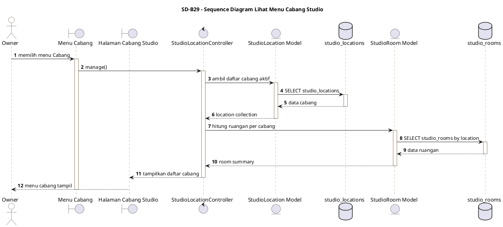
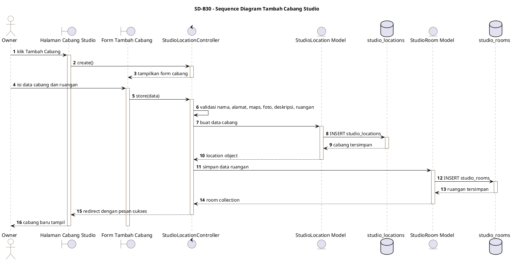
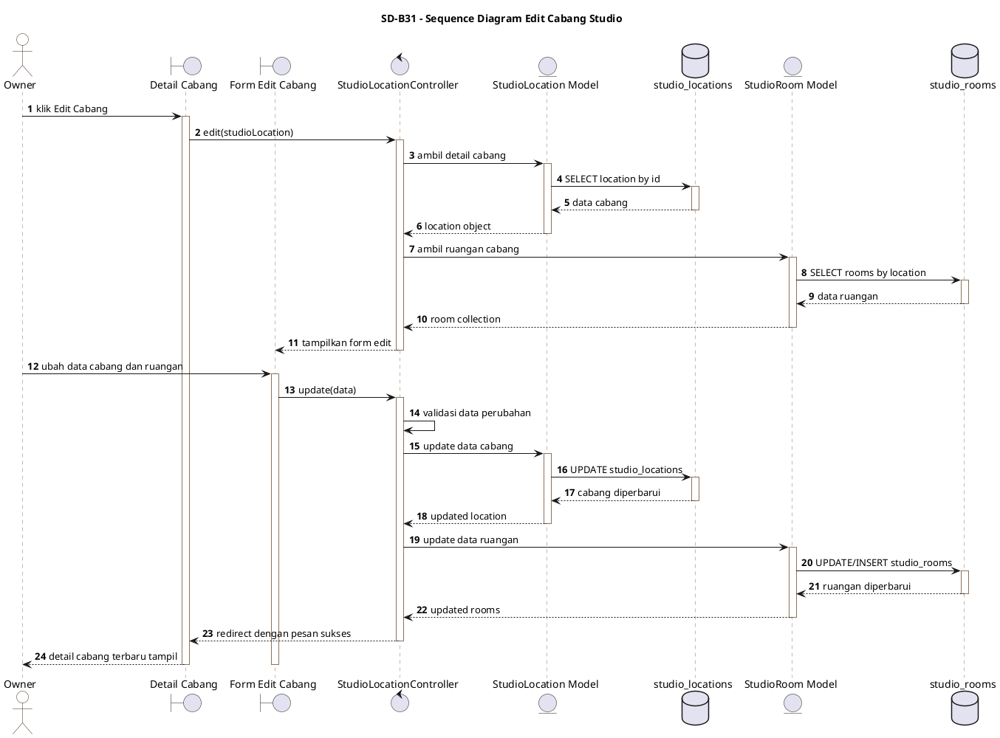
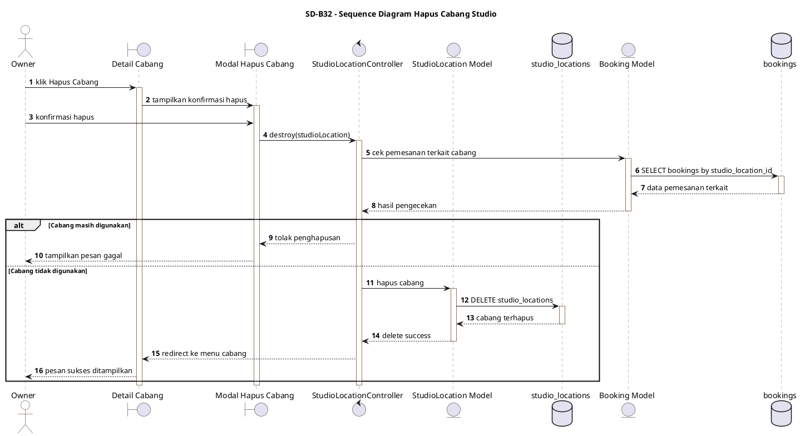
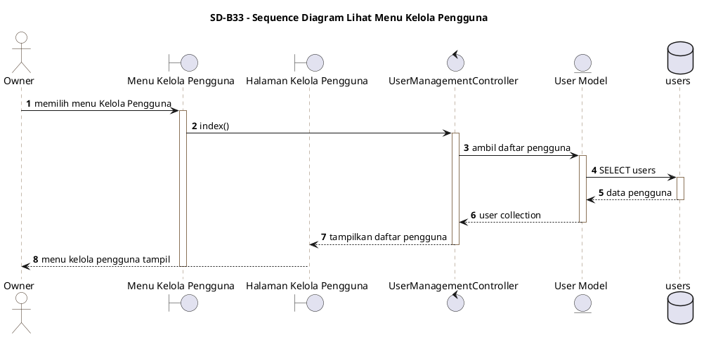
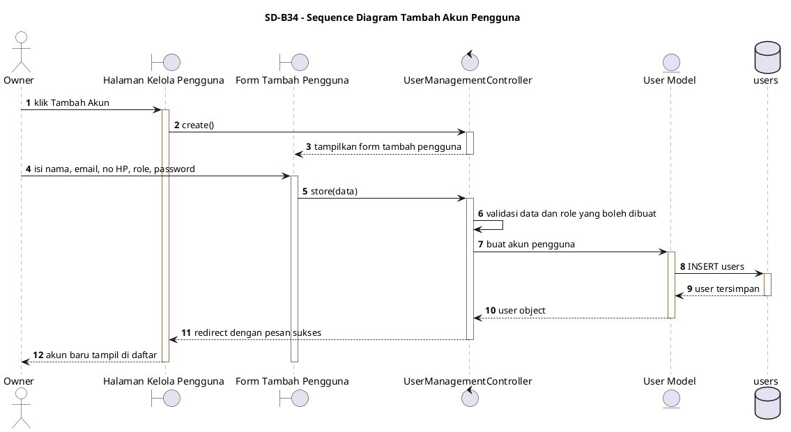
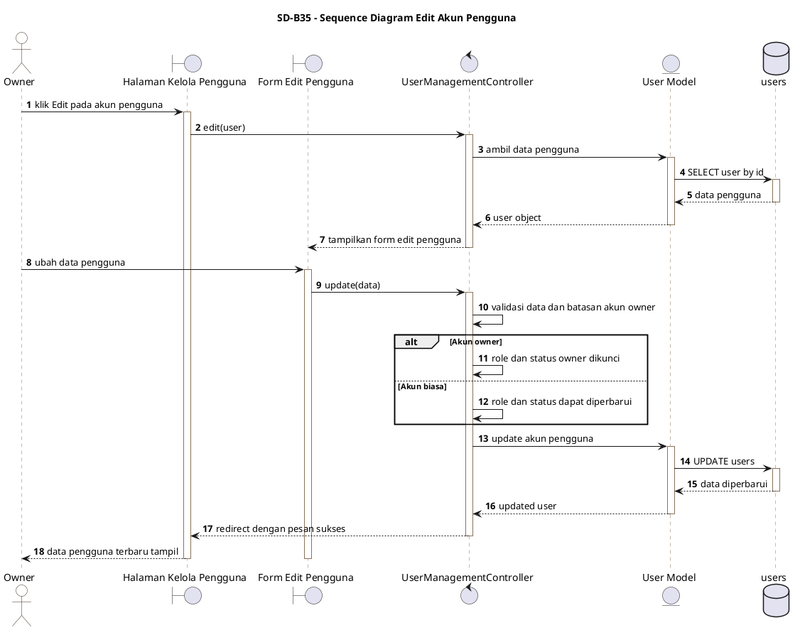
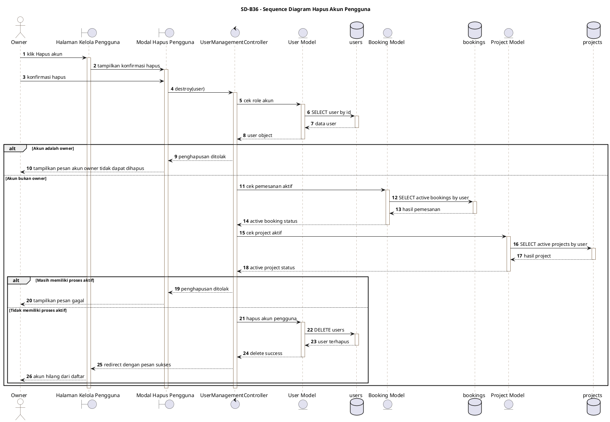
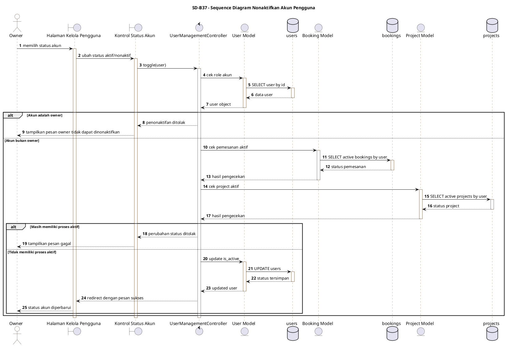
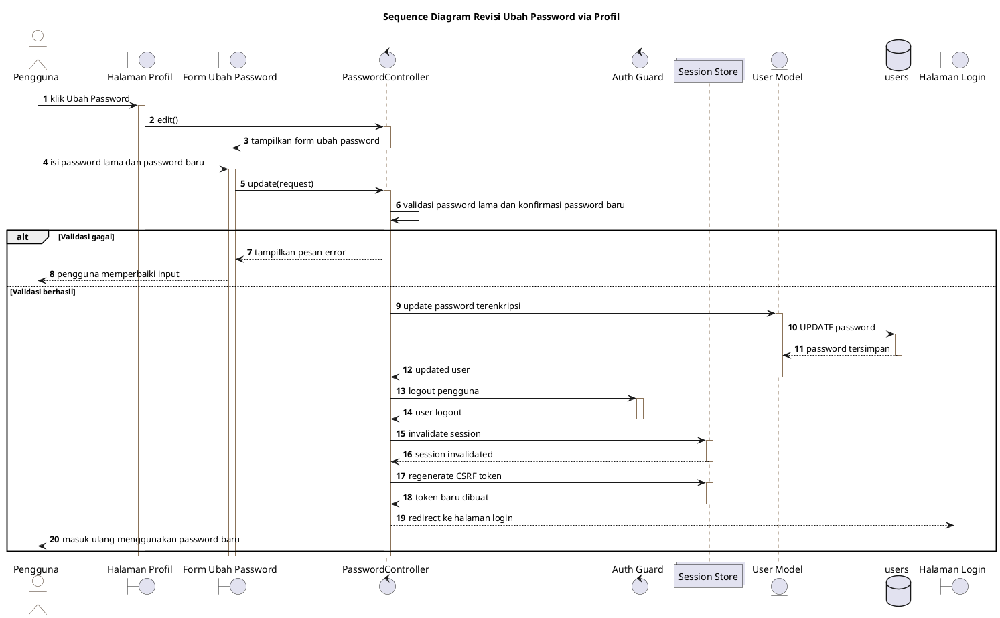

# Sequence Diagram Revisi Owner dan Ubah Password Profil

```plantuml
@startuml SD-B29
title SD-B29 - Sequence Diagram Lihat Menu Cabang Studio
skinparam backgroundColor #FFFFFF
skinparam sequenceArrowThickness 1
skinparam sequenceLifeLineBorderColor #8B7359
skinparam sequenceParticipantBorderColor #8B7359
skinparam sequenceParticipantBackgroundColor #FAF6F0
skinparam actorBorderColor #3F2B1B
skinparam actorBackgroundColor #FFFFFF
autonumber
actor "Owner" as Owner
boundary "Menu Cabang" as Menu
boundary "Halaman Cabang Studio" as Page
control "StudioLocationController" as Controller
entity "StudioLocation Model" as LocationModel
database "studio_locations" as Locations
entity "StudioRoom Model" as RoomModel
database "studio_rooms" as Rooms

Owner -> Menu: memilih menu Cabang
activate Menu
Menu -> Controller: manage()
activate Controller
Controller -> LocationModel: ambil daftar cabang aktif
activate LocationModel
LocationModel -> Locations: SELECT studio_locations
activate Locations
Locations --> LocationModel: data cabang
deactivate Locations
LocationModel --> Controller: location collection
deactivate LocationModel
Controller -> RoomModel: hitung ruangan per cabang
activate RoomModel
RoomModel -> Rooms: SELECT studio_rooms by location
activate Rooms
Rooms --> RoomModel: data ruangan
deactivate Rooms
RoomModel --> Controller: room summary
deactivate RoomModel
Controller --> Page: tampilkan daftar cabang
deactivate Controller
Page --> Owner: menu cabang tampil
deactivate Menu
@enduml
```

```plantuml
@startuml SD-B30
title SD-B30 - Sequence Diagram Tambah Cabang Studio
skinparam backgroundColor #FFFFFF
skinparam sequenceArrowThickness 1
skinparam sequenceLifeLineBorderColor #8B7359
skinparam sequenceParticipantBorderColor #8B7359
skinparam sequenceParticipantBackgroundColor #FAF6F0
skinparam actorBorderColor #3F2B1B
skinparam actorBackgroundColor #FFFFFF
autonumber
actor "Owner" as Owner
boundary "Halaman Cabang Studio" as Page
boundary "Form Tambah Cabang" as Form
control "StudioLocationController" as Controller
entity "StudioLocation Model" as LocationModel
database "studio_locations" as Locations
entity "StudioRoom Model" as RoomModel
database "studio_rooms" as Rooms

Owner -> Page: klik Tambah Cabang
activate Page
Page -> Controller: create()
activate Controller
Controller --> Form: tampilkan form cabang
deactivate Controller
Owner -> Form: isi data cabang dan ruangan
activate Form
Form -> Controller: store(data)
activate Controller
Controller -> Controller: validasi nama, alamat, maps, foto, deskripsi, ruangan
Controller -> LocationModel: buat data cabang
activate LocationModel
LocationModel -> Locations: INSERT studio_locations
activate Locations
Locations --> LocationModel: cabang tersimpan
deactivate Locations
LocationModel --> Controller: location object
deactivate LocationModel
Controller -> RoomModel: simpan data ruangan
activate RoomModel
RoomModel -> Rooms: INSERT studio_rooms
activate Rooms
Rooms --> RoomModel: ruangan tersimpan
deactivate Rooms
RoomModel --> Controller: room collection
deactivate RoomModel
Controller --> Page: redirect dengan pesan sukses
deactivate Controller
Page --> Owner: cabang baru tampil
deactivate Form
deactivate Page
@enduml
```

```plantuml
@startuml SD-B31
title SD-B31 - Sequence Diagram Edit Cabang Studio
skinparam backgroundColor #FFFFFF
skinparam sequenceArrowThickness 1
skinparam sequenceLifeLineBorderColor #8B7359
skinparam sequenceParticipantBorderColor #8B7359
skinparam sequenceParticipantBackgroundColor #FAF6F0
skinparam actorBorderColor #3F2B1B
skinparam actorBackgroundColor #FFFFFF
autonumber
actor "Owner" as Owner
boundary "Detail Cabang" as Detail
boundary "Form Edit Cabang" as Form
control "StudioLocationController" as Controller
entity "StudioLocation Model" as LocationModel
database "studio_locations" as Locations
entity "StudioRoom Model" as RoomModel
database "studio_rooms" as Rooms

Owner -> Detail: klik Edit Cabang
activate Detail
Detail -> Controller: edit(studioLocation)
activate Controller
Controller -> LocationModel: ambil detail cabang
activate LocationModel
LocationModel -> Locations: SELECT location by id
activate Locations
Locations --> LocationModel: data cabang
deactivate Locations
LocationModel --> Controller: location object
deactivate LocationModel
Controller -> RoomModel: ambil ruangan cabang
activate RoomModel
RoomModel -> Rooms: SELECT rooms by location
activate Rooms
Rooms --> RoomModel: data ruangan
deactivate Rooms
RoomModel --> Controller: room collection
deactivate RoomModel
Controller --> Form: tampilkan form edit
deactivate Controller
Owner -> Form: ubah data cabang dan ruangan
activate Form
Form -> Controller: update(data)
activate Controller
Controller -> Controller: validasi data perubahan
Controller -> LocationModel: update data cabang
activate LocationModel
LocationModel -> Locations: UPDATE studio_locations
activate Locations
Locations --> LocationModel: cabang diperbarui
deactivate Locations
LocationModel --> Controller: updated location
deactivate LocationModel
Controller -> RoomModel: update data ruangan
activate RoomModel
RoomModel -> Rooms: UPDATE/INSERT studio_rooms
activate Rooms
Rooms --> RoomModel: ruangan diperbarui
deactivate Rooms
RoomModel --> Controller: updated rooms
deactivate RoomModel
Controller --> Detail: redirect dengan pesan sukses
deactivate Controller
Detail --> Owner: detail cabang terbaru tampil
deactivate Form
deactivate Detail
@enduml
```

```plantuml
@startuml SD-B32
title SD-B32 - Sequence Diagram Hapus Cabang Studio
skinparam backgroundColor #FFFFFF
skinparam sequenceArrowThickness 1
skinparam sequenceLifeLineBorderColor #8B7359
skinparam sequenceParticipantBorderColor #8B7359
skinparam sequenceParticipantBackgroundColor #FAF6F0
skinparam actorBorderColor #3F2B1B
skinparam actorBackgroundColor #FFFFFF
autonumber
actor "Owner" as Owner
boundary "Detail Cabang" as Detail
boundary "Modal Hapus Cabang" as Modal
control "StudioLocationController" as Controller
entity "StudioLocation Model" as LocationModel
database "studio_locations" as Locations
entity "Booking Model" as BookingModel
database "bookings" as Bookings

Owner -> Detail: klik Hapus Cabang
activate Detail
Detail -> Modal: tampilkan konfirmasi hapus
activate Modal
Owner -> Modal: konfirmasi hapus
Modal -> Controller: destroy(studioLocation)
activate Controller
Controller -> BookingModel: cek pemesanan terkait cabang
activate BookingModel
BookingModel -> Bookings: SELECT bookings by studio_location_id
activate Bookings
Bookings --> BookingModel: data pemesanan terkait
deactivate Bookings
BookingModel --> Controller: hasil pengecekan
deactivate BookingModel
alt Cabang masih digunakan
    Controller --> Modal: tolak penghapusan
    Modal --> Owner: tampilkan pesan gagal
else Cabang tidak digunakan
    Controller -> LocationModel: hapus cabang
    activate LocationModel
    LocationModel -> Locations: DELETE studio_locations
    activate Locations
    Locations --> LocationModel: cabang terhapus
    deactivate Locations
    LocationModel --> Controller: delete success
    deactivate LocationModel
    Controller --> Detail: redirect ke menu cabang
    Detail --> Owner: pesan sukses ditampilkan
end
deactivate Controller
deactivate Modal
deactivate Detail
@enduml
```

```plantuml
@startuml SD-B33
title SD-B33 - Sequence Diagram Lihat Menu Kelola Pengguna
skinparam backgroundColor #FFFFFF
skinparam sequenceArrowThickness 1
skinparam sequenceLifeLineBorderColor #8B7359
skinparam sequenceParticipantBorderColor #8B7359
skinparam sequenceParticipantBackgroundColor #FAF6F0
skinparam actorBorderColor #3F2B1B
skinparam actorBackgroundColor #FFFFFF
autonumber
actor "Owner" as Owner
boundary "Menu Kelola Pengguna" as Menu
boundary "Halaman Kelola Pengguna" as Page
control "UserManagementController" as Controller
entity "User Model" as UserModel
database "users" as Users

Owner -> Menu: memilih menu Kelola Pengguna
activate Menu
Menu -> Controller: index()
activate Controller
Controller -> UserModel: ambil daftar pengguna
activate UserModel
UserModel -> Users: SELECT users
activate Users
Users --> UserModel: data pengguna
deactivate Users
UserModel --> Controller: user collection
deactivate UserModel
Controller --> Page: tampilkan daftar pengguna
deactivate Controller
Page --> Owner: menu kelola pengguna tampil
deactivate Menu
@enduml
```

```plantuml
@startuml SD-B34
title SD-B34 - Sequence Diagram Tambah Akun Pengguna
skinparam backgroundColor #FFFFFF
skinparam sequenceArrowThickness 1
skinparam sequenceLifeLineBorderColor #8B7359
skinparam sequenceParticipantBorderColor #8B7359
skinparam sequenceParticipantBackgroundColor #FAF6F0
skinparam actorBorderColor #3F2B1B
skinparam actorBackgroundColor #FFFFFF
autonumber
actor "Owner" as Owner
boundary "Halaman Kelola Pengguna" as Page
boundary "Form Tambah Pengguna" as Form
control "UserManagementController" as Controller
entity "User Model" as UserModel
database "users" as Users

Owner -> Page: klik Tambah Akun
activate Page
Page -> Controller: create()
activate Controller
Controller --> Form: tampilkan form tambah pengguna
deactivate Controller
Owner -> Form: isi nama, email, no HP, role, password
activate Form
Form -> Controller: store(data)
activate Controller
Controller -> Controller: validasi data dan role yang boleh dibuat
Controller -> UserModel: buat akun pengguna
activate UserModel
UserModel -> Users: INSERT users
activate Users
Users --> UserModel: user tersimpan
deactivate Users
UserModel --> Controller: user object
deactivate UserModel
Controller --> Page: redirect dengan pesan sukses
deactivate Controller
Page --> Owner: akun baru tampil di daftar
deactivate Form
deactivate Page
@enduml
```

```plantuml
@startuml SD-B35
title SD-B35 - Sequence Diagram Edit Akun Pengguna
skinparam backgroundColor #FFFFFF
skinparam sequenceArrowThickness 1
skinparam sequenceLifeLineBorderColor #8B7359
skinparam sequenceParticipantBorderColor #8B7359
skinparam sequenceParticipantBackgroundColor #FAF6F0
skinparam actorBorderColor #3F2B1B
skinparam actorBackgroundColor #FFFFFF
autonumber
actor "Owner" as Owner
boundary "Halaman Kelola Pengguna" as Page
boundary "Form Edit Pengguna" as Form
control "UserManagementController" as Controller
entity "User Model" as UserModel
database "users" as Users

Owner -> Page: klik Edit pada akun pengguna
activate Page
Page -> Controller: edit(user)
activate Controller
Controller -> UserModel: ambil data pengguna
activate UserModel
UserModel -> Users: SELECT user by id
activate Users
Users --> UserModel: data pengguna
deactivate Users
UserModel --> Controller: user object
deactivate UserModel
Controller --> Form: tampilkan form edit pengguna
deactivate Controller
Owner -> Form: ubah data pengguna
activate Form
Form -> Controller: update(data)
activate Controller
Controller -> Controller: validasi data dan batasan akun owner
alt Akun owner
    Controller -> Controller: role dan status owner dikunci
else Akun biasa
    Controller -> Controller: role dan status dapat diperbarui
end
Controller -> UserModel: update akun pengguna
activate UserModel
UserModel -> Users: UPDATE users
activate Users
Users --> UserModel: data diperbarui
deactivate Users
UserModel --> Controller: updated user
deactivate UserModel
Controller --> Page: redirect dengan pesan sukses
deactivate Controller
Page --> Owner: data pengguna terbaru tampil
deactivate Form
deactivate Page
@enduml
```

```plantuml
@startuml SD-B36
title SD-B36 - Sequence Diagram Hapus Akun Pengguna
skinparam backgroundColor #FFFFFF
skinparam sequenceArrowThickness 1
skinparam sequenceLifeLineBorderColor #8B7359
skinparam sequenceParticipantBorderColor #8B7359
skinparam sequenceParticipantBackgroundColor #FAF6F0
skinparam actorBorderColor #3F2B1B
skinparam actorBackgroundColor #FFFFFF
autonumber
actor "Owner" as Owner
boundary "Halaman Kelola Pengguna" as Page
boundary "Modal Hapus Pengguna" as Modal
control "UserManagementController" as Controller
entity "User Model" as UserModel
database "users" as Users
entity "Booking Model" as BookingModel
database "bookings" as Bookings
entity "Project Model" as ProjectModel
database "projects" as Projects

Owner -> Page: klik Hapus akun
activate Page
Page -> Modal: tampilkan konfirmasi hapus
activate Modal
Owner -> Modal: konfirmasi hapus
Modal -> Controller: destroy(user)
activate Controller
Controller -> UserModel: cek role akun
activate UserModel
UserModel -> Users: SELECT user by id
activate Users
Users --> UserModel: data user
deactivate Users
UserModel --> Controller: user object
deactivate UserModel
alt Akun adalah owner
    Controller --> Modal: penghapusan ditolak
    Modal --> Owner: tampilkan pesan akun owner tidak dapat dihapus
else Akun bukan owner
    Controller -> BookingModel: cek pemesanan aktif
    activate BookingModel
    BookingModel -> Bookings: SELECT active bookings by user
    activate Bookings
    Bookings --> BookingModel: hasil pemesanan
    deactivate Bookings
    BookingModel --> Controller: active booking status
    deactivate BookingModel
    Controller -> ProjectModel: cek project aktif
    activate ProjectModel
    ProjectModel -> Projects: SELECT active projects by user
    activate Projects
    Projects --> ProjectModel: hasil project
    deactivate Projects
    ProjectModel --> Controller: active project status
    deactivate ProjectModel
    alt Masih memiliki proses aktif
        Controller --> Modal: penghapusan ditolak
        Modal --> Owner: tampilkan pesan gagal
    else Tidak memiliki proses aktif
        Controller -> UserModel: hapus akun pengguna
        activate UserModel
        UserModel -> Users: DELETE users
        activate Users
        Users --> UserModel: user terhapus
        deactivate Users
        UserModel --> Controller: delete success
        deactivate UserModel
        Controller --> Page: redirect dengan pesan sukses
        Page --> Owner: akun hilang dari daftar
    end
end
deactivate Controller
deactivate Modal
deactivate Page
@enduml
```

```plantuml
@startuml SD-B37
title SD-B37 - Sequence Diagram Nonaktifkan Akun Pengguna
skinparam backgroundColor #FFFFFF
skinparam sequenceArrowThickness 1
skinparam sequenceLifeLineBorderColor #8B7359
skinparam sequenceParticipantBorderColor #8B7359
skinparam sequenceParticipantBackgroundColor #FAF6F0
skinparam actorBorderColor #3F2B1B
skinparam actorBackgroundColor #FFFFFF
autonumber
actor "Owner" as Owner
boundary "Halaman Kelola Pengguna" as Page
boundary "Kontrol Status Akun" as StatusControl
control "UserManagementController" as Controller
entity "User Model" as UserModel
database "users" as Users
entity "Booking Model" as BookingModel
database "bookings" as Bookings
entity "Project Model" as ProjectModel
database "projects" as Projects

Owner -> Page: memilih status akun
activate Page
Page -> StatusControl: ubah status aktif/nonaktif
activate StatusControl
StatusControl -> Controller: toggle(user)
activate Controller
Controller -> UserModel: cek role akun
activate UserModel
UserModel -> Users: SELECT user by id
activate Users
Users --> UserModel: data user
deactivate Users
UserModel --> Controller: user object
deactivate UserModel
alt Akun adalah owner
    Controller --> StatusControl: penonaktifan ditolak
    StatusControl --> Owner: tampilkan pesan owner tidak dapat dinonaktifkan
else Akun bukan owner
    Controller -> BookingModel: cek pemesanan aktif
    activate BookingModel
    BookingModel -> Bookings: SELECT active bookings by user
    activate Bookings
    Bookings --> BookingModel: status pemesanan
    deactivate Bookings
    BookingModel --> Controller: hasil pengecekan
    deactivate BookingModel
    Controller -> ProjectModel: cek project aktif
    activate ProjectModel
    ProjectModel -> Projects: SELECT active projects by user
    activate Projects
    Projects --> ProjectModel: status project
    deactivate Projects
    ProjectModel --> Controller: hasil pengecekan
    deactivate ProjectModel
    alt Masih memiliki proses aktif
        Controller --> StatusControl: perubahan status ditolak
        StatusControl --> Owner: tampilkan pesan gagal
    else Tidak memiliki proses aktif
        Controller -> UserModel: update is_active
        activate UserModel
        UserModel -> Users: UPDATE users
        activate Users
        Users --> UserModel: status tersimpan
        deactivate Users
        UserModel --> Controller: updated user
        deactivate UserModel
        Controller --> Page: redirect dengan pesan sukses
        Page --> Owner: status akun diperbarui
    end
end
deactivate Controller
deactivate StatusControl
deactivate Page
@enduml
```

```plantuml
@startuml SD-UBAH-PASSWORD-PROFIL
title Sequence Diagram Revisi Ubah Password via Profil
skinparam backgroundColor #FFFFFF
skinparam sequenceArrowThickness 1
skinparam sequenceLifeLineBorderColor #8B7359
skinparam sequenceParticipantBorderColor #8B7359
skinparam sequenceParticipantBackgroundColor #FAF6F0
skinparam actorBorderColor #3F2B1B
skinparam actorBackgroundColor #FFFFFF
autonumber
actor "Pengguna" as User
boundary "Halaman Profil" as Profile
boundary "Form Ubah Password" as Form
control "PasswordController" as Controller
control "Auth Guard" as Auth
collections "Session Store" as Session
entity "User Model" as UserModel
database "users" as Users
boundary "Halaman Login" as Login

User -> Profile: klik Ubah Password
activate Profile
Profile -> Controller: edit()
activate Controller
Controller --> Form: tampilkan form ubah password
deactivate Controller
User -> Form: isi password lama dan password baru
activate Form
Form -> Controller: update(request)
activate Controller
Controller -> Controller: validasi password lama dan konfirmasi password baru
alt Validasi gagal
    Controller --> Form: tampilkan pesan error
    Form --> User: pengguna memperbaiki input
else Validasi berhasil
    Controller -> UserModel: update password terenkripsi
    activate UserModel
    UserModel -> Users: UPDATE password
    activate Users
    Users --> UserModel: password tersimpan
    deactivate Users
    UserModel --> Controller: updated user
    deactivate UserModel
    Controller -> Auth: logout pengguna
    activate Auth
    Auth --> Controller: user logout
    deactivate Auth
    Controller -> Session: invalidate session
    activate Session
    Session --> Controller: session invalidated
    deactivate Session
    Controller -> Session: regenerate CSRF token
    activate Session
    Session --> Controller: token baru dibuat
    deactivate Session
    Controller --> Login: redirect ke halaman login
    Login --> User: masuk ulang menggunakan password baru
end
deactivate Controller
deactivate Form
deactivate Profile
@enduml
```
